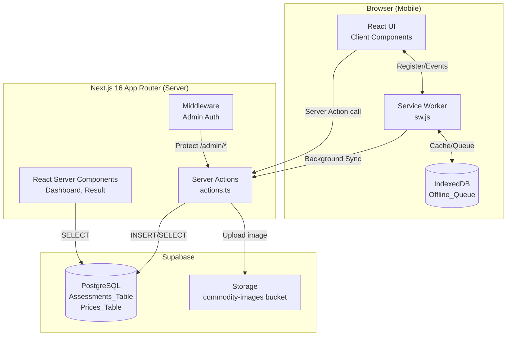
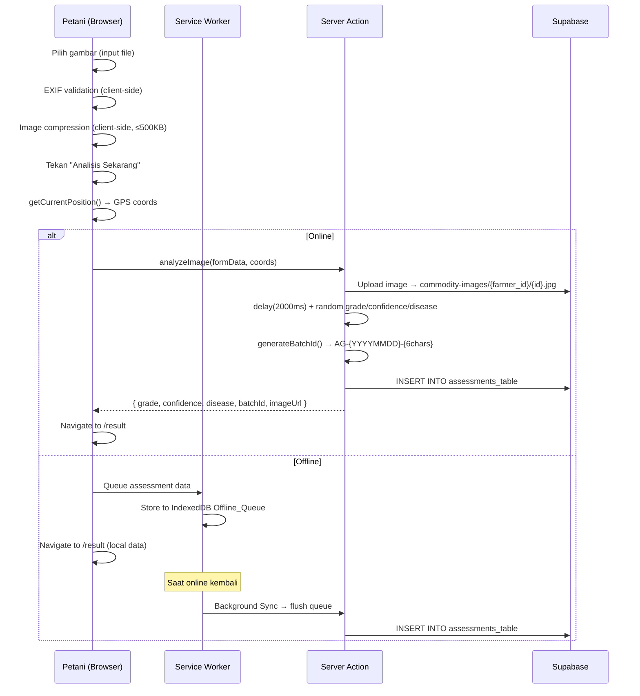
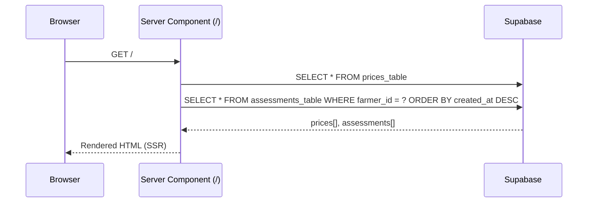

# Design Document — AgriGrade MVP

## Overview

AgriGrade adalah platform kurasi hasil tani berbasis mobile-first yang memungkinkan petani menilai kualitas komoditas (Vanili, Cengkeh) secara mandiri menggunakan kamera smartphone. Sistem ini dibangun di atas Next.js 16 App Router, Tailwind CSS v4, Supabase (Database + Storage), dan Shadcn UI.

Pada fase MVP, analisis AI disimulasikan di sisi server (Server Action) dengan delay 2 detik dan hasil acak. Sistem mendukung mode offline penuh melalui PWA dengan Background Sync dan IndexedDB.

### Tujuan Desain

- **Mobile-first**: Layout max-width 480px, dioptimalkan untuk smartphone petani di lapangan.
- **Offline-capable**: Petani di area sinyal lemah tetap bisa scan dan data tersimpan lokal.
- **Traceable**: Setiap scan menghasilkan Batch ID unik yang menghubungkan karung fisik dengan data digital.
- **Extensible**: Arsitektur siap untuk integrasi model AI nyata dan autentikasi penuh di fase berikutnya.

---

## Architecture

### System Architecture Diagram



### Data Flow — Scan Komoditas



### Data Flow — Dashboard



---

## Components and Interfaces

### Folder Structure (Next.js 16 App Router)

```
agrigrade-app/
├── .github/
│   └── workflows/
│       └── ci.yml                    # GitHub Actions CI pipeline (test + build)
│
├── app/
│   ├── layout.tsx                    # Root layout (PWA meta, SW registration, Analytics, SpeedInsights)
│   ├── page.tsx                      # Dashboard (/) — Server Component
│   ├── manifest.ts                   # PWA manifest (Next.js built-in)
│   ├── globals.css                   # Tailwind v4 base styles + CSS variables
│   │
│   ├── scan/
│   │   └── page.tsx                  # Camera Page (/scan) — Client Component
│   │
│   ├── result/
│   │   └── page.tsx                  # Result Page (/result) — Client Component
│   │
│   ├── admin/
│   │   ├── login/
│   │   │   └── page.tsx              # Admin Login Page (/admin/login) — Client Component
│   │   └── verify/
│   │       └── page.tsx              # Admin Page (/admin/verify) — Client Component
│   │
│   ├── actions/
│   │   ├── analyze.ts                # Server Action: analyzeImage()
│   │   ├── assessments.ts            # Server Action: saveAssessment(), getAssessments()
│   │   ├── prices.ts                 # Server Action: getPrices()
│   │   └── admin.ts                  # Server Action: verifyAssessment(), downgradeAssessment(), verifyAdminPassword()
│   │
│   └── _components/
│       ├── ui/                       # Shadcn UI re-exports
│       ├── PriceCard.tsx             # Kartu harga komoditas
│       ├── AssessmentHistoryItem.tsx # Item riwayat scan (menggunakan next/image untuk thumbnail)
│       ├── GradeBadge.tsx            # Badge grade A/B dengan warna
│       ├── FactoryMap.tsx            # Embed peta lokasi pabrik
│       ├── BatchIdDisplay.tsx        # Tampilan + tombol salin Batch ID
│       ├── OfflineIndicator.tsx      # Indikator item offline queue
│       ├── AdminAssessmentRow.tsx    # Baris assessment di halaman admin
│       └── HighContrastToggle.tsx    # Toggle button untuk High Contrast Mode
│
├── lib/
│   ├── supabase/
│   │   ├── client.ts                 # Supabase browser client
│   │   └── server.ts                 # Supabase server client (Server Actions/RSC)
│   ├── batch-id.ts                   # generateBatchId() utility
│   ├── image-compressor.ts           # compressImage() client-side utility
│   ├── exif-validator.ts             # extractExifDate() client-side utility
│   ├── offline-queue.ts              # IndexedDB Offline_Queue operations
│   ├── validations.ts                # Zod schemas untuk Server Action input validation
│   ├── contrast-mode.ts              # Utility untuk read/write preferensi High Contrast ke localStorage
│   ├── haptic.ts                     # Wrapper Vibration API dengan graceful degradation
│   ├── export-pdf.ts                 # Client-side PDF generation menggunakan library jspdf
│   ├── export-csv.ts                 # Client-side CSV generation (native, tanpa library)
│   └── logger.ts                     # Structured logging wrapper (console.error dengan format standar)
│
├── supabase/
│   └── functions/
│       └── cleanup-old-images/
│           └── index.ts              # Supabase Edge Function untuk cleanup gambar lama
│
├── public/
│   ├── sw.js                         # Service Worker (caching + Background Sync)
│   ├── icon-192x192.png
│   ├── icon-512x512.png
│   └── icons/                        # PWA icon variants
│
├── middleware.ts                     # Next.js Middleware — proteksi rute /admin/*
├── .env.local                        # SUPABASE_URL, SUPABASE_ANON_KEY, ADMIN_PASSWORD
└── next.config.ts                    # SW headers, security headers
```

### Komponen UI Utama

#### `app/page.tsx` — Dashboard (Server Component)

```typescript
// Server Component — data fetching di server
export default async function DashboardPage() {
  const prices = await getPrices()           // dari Prices_Table
  const assessments = await getAssessments() // dari Assessments_Table, ordered by created_at DESC
  
  return (
    <main className="max-w-[480px] mx-auto min-h-screen bg-white">
      <Header />
      <PriceSection prices={prices} />
      <OfflineIndicator />                   // Client Component
      <AssessmentHistory assessments={assessments} />
      <ScanButton />                         // Link ke /scan
    </main>
  )
}
```

#### `app/scan/page.tsx` — Camera Page (Client Component)

```typescript
'use client'
// State: selectedFile, previewUrl, compressedSize, isLoading, error, gpsWarning, exifWarning
// Handlers:
//   handleFileChange(e) → EXIF validation + image compression + preview
//   handleAnalyze() → getCurrentPosition() → analyzeWithTimeout() → Server Action → navigate to /result
// Haptic feedback:
//   WHEN analisis selesai sukses → vibrateSuccess()
//   WHEN error → vibrateError()
```

#### `app/result/page.tsx` — Result Page (Client Component)

```typescript
'use client'
// Membaca data dari sessionStorage (dikirim dari scan page setelah analisis)
// Menampilkan: GradeBadge, confidence %, disease status, FactoryMap, BatchIdDisplay
// WHEN halaman dimuat dengan data sukses → vibrateSuccess()
// WHEN data EXIF DateTimeOriginal tersedia (dari sessionStorage) → tampilkan "Waktu Pengambilan Foto: {tanggal dan waktu}"
// Tombol: "Scan Lagi" → /scan, "Kembali ke Dashboard" → /
```

#### `app/admin/verify/page.tsx` — Admin Page (Client Component)

```typescript
'use client'
// State: isAuthenticated, password, assessments[], searchQuery, searchResult
// Login form → POST ke Server Action verifyAdminPassword()
// Search bar: input text untuk Batch ID search
//   handleSearch(batchId) → Server Action searchAssessmentByBatchId(batchId)
//   Menampilkan single result card jika ditemukan, atau "Kode tidak ditemukan" jika tidak ada
// Daftar assessments dengan is_verified=false (di bawah search bar)
// Tombol per item: "Verifikasi Grade A" | "Turunkan ke Grade B"
```

### Server Actions Interface

Semua Server Actions memvalidasi input menggunakan **Zod** (lihat `lib/validations.ts`) sebelum diproses. Jika validasi gagal, action langsung mengembalikan `{ success: false, error: ..., code: 'VALIDATION_ERROR' }` tanpa meneruskan ke logika bisnis.

```typescript
// app/actions/analyze.ts
// Input divalidasi dengan AnalyzeImageSchema (Zod) sebelum diproses:
//   - formData: file harus bertipe image/* (MIME type validation)
//   - coords.latitude: z.number().nullable(), range -90 to 90
//   - coords.longitude: z.number().nullable(), range -180 to 180
export async function analyzeImage(
  formData: FormData,
  coords: { latitude: number | null; longitude: number | null }
): Promise<{
  success: boolean
  data?: {
    grade: 'A' | 'B'
    confidence: number
    disease: boolean
    batchId: string
    imageUrl: string
    assessmentId: string
  }
  error?: string
  code?: string
}>

// app/actions/assessments.ts
// saveAssessment: input divalidasi dengan AssessmentInsertSchema (Zod) sebelum INSERT ke Supabase
export async function saveAssessment(data: AssessmentInsert): Promise<{ success: boolean; id?: string; error?: string; code?: string }>
export async function getAssessments(farmerId: string): Promise<Assessment[]>

// app/actions/prices.ts
export async function getPrices(): Promise<Price[]>

// app/actions/admin.ts
export async function verifyAdminPassword(password: string): Promise<boolean>
export async function verifyAssessmentGrade(assessmentId: string): Promise<{ success: boolean }>
export async function downgradeAssessmentToB(assessmentId: string): Promise<{ success: boolean }>
export async function searchAssessmentByBatchId(batchId: string): Promise<Assessment | null>
// Query: SELECT * FROM assessments_table WHERE batch_id = $1 LIMIT 1
// Mengembalikan Assessment jika ditemukan, null jika tidak ada
// Input divalidasi dengan Zod: batchId harus string non-empty yang cocok dengan pattern AG-\d{8}-[A-Z0-9]{6}

// app/actions/assessments.ts (tambahan)
export async function getSignedImageUrl(path: string): Promise<string>
// supabase.storage.from('commodity-images').createSignedUrl(path, 3600)
// Dipanggil saat render Dashboard dan Admin Page untuk setiap gambar
// TTL: 3600 detik (1 jam)
```
### Client-Side Utilities Interface

```typescript
// lib/image-compressor.ts
// Algoritma kompresi:
//   1. FileReader.readAsDataURL() → load file ke memory
//   2. new Image() → decode ke bitmap
//   3. canvas.getContext('2d').drawImage() dengan dimensi yang di-scale down
//   4. canvas.toBlob('image/jpeg', quality) dengan iterative quality reduction
//      (mulai dari quality=0.9, turunkan 0.1 per iterasi) hingga ukuran ≤ 500KB
//   5. Jika gambar sudah ≤ 500KB sejak awal, kembalikan langsung tanpa kompresi
export async function compressImage(
  file: File,
  maxSizeKB: number = 500
): Promise<{ blob: Blob; sizeKB: number; width: number; height: number }>

// Blur-up placeholder: generate base64 thumbnail 8x8px dari blob yang sudah dikompres
// Disimpan ke kolom blur_data_url di assessments_table
// Digunakan sebagai blurDataURL prop di next/image pada AssessmentHistoryItem.tsx
export async function generateBlurDataUrl(blob: Blob): Promise<string>
// Implementasi: canvas 8x8px → drawImage → canvas.toDataURL('image/jpeg', 0.5) → base64 string

// lib/exif-validator.ts
export async function extractExifDate(file: File): Promise<Date | null>
export function isPhotoTooOld(exifDate: Date, referenceTime: Date, thresholdHours: number = 24): boolean

// lib/batch-id.ts
export function generateBatchId(): string
// Returns: AG-{YYYYMMDD}-{6 uppercase alphanumeric chars}
// Example: AG-20250715-X4K9MZ

// lib/offline-queue.ts
export async function enqueueAssessment(data: OfflineAssessmentData): Promise<void>
export async function dequeueAll(): Promise<OfflineAssessmentData[]>
export async function clearQueue(): Promise<void>
export async function getQueueCount(): Promise<number>

// lib/validations.ts (Zod schemas)
// AnalyzeImageSchema — validasi input analyzeImage()
//   - file: z.instanceof(File).refine(f => f.type.startsWith('image/'), 'Harus berupa file gambar')
//              .refine(f => f.size <= 500 * 1024, 'Ukuran file maksimum 500KB')  ← defense in depth
//   - coords.latitude: z.number().min(-90).max(90).nullable()
//   - coords.longitude: z.number().min(-180).max(180).nullable()
// AssessmentInsertSchema — validasi semua field sebelum INSERT ke Supabase
// Catatan: Validasi ukuran file 500KB di Zod sinkron dengan batas kompresi di image-compressor.ts
//          — defense in depth: kompresi di client, validasi di server

// lib/logger.ts
// Structured logging wrapper untuk Server Actions
// Format: [AgriGrade][ActionName] error: ${error.message}
// Output visible di Vercel Function Logs
export function logError(actionName: string, error: unknown): void
export function logInfo(actionName: string, message: string): void

// lib/export-pdf.ts
export async function exportScanReportPDF(assessment: Assessment): Promise<void>
// Menggunakan jspdf untuk generate PDF dengan layout: header AgriGrade, Kode Karung, Kelas Mutu, Tingkat Keakuratan, Status Kesehatan, tanggal scan
// Memicu download otomatis: agrigrade-laporan-{batch_id}.pdf

// lib/export-csv.ts
export function exportAssessmentsCSV(assessments: Assessment[]): void
// Menggunakan Blob API native untuk generate CSV
// Kolom: batch_id, grade, confidence, disease, created_at, latitude, longitude, image_url
// Memicu download otomatis: agrigrade-riwayat-{YYYYMMDD}.csv

// lib/contrast-mode.ts
// Utility untuk read/write preferensi High Contrast Mode ke localStorage
// Key: 'agrigrade_high_contrast'
// Toggle menambahkan/menghapus class 'high-contrast' pada <html> element

// lib/haptic.ts
// Wrapper untuk Vibration API dengan graceful degradation
export function vibrateSuccess(): void
// navigator.vibrate(200) — getaran pendek 200ms untuk scan berhasil

export function vibrateError(): void
// navigator.vibrate([100, 50, 100]) — pola dua getaran untuk error/gagal

export function isVibrationSupported(): boolean
// return typeof navigator !== 'undefined' && 'vibrate' in navigator
```

> **Catatan**: Komponen `AssessmentHistoryItem.tsx` menggunakan `next/image` (bukan ``) untuk menampilkan thumbnail foto di Dashboard, memanfaatkan Next.js automatic image optimization (resize, format conversion, lazy loading). Komponen ini menggunakan prop `placeholder="blur"` dengan `blurDataURL` yang diambil dari kolom `blur_data_url` di database (base64 thumbnail 8x8px). Sebelum render, komponen fetch signed URL via Server Action `getSignedImageUrl()` karena bucket `commodity-images` bersifat private. Jika `image_url === '[DELETED]'`, komponen menampilkan placeholder "Gambar tidak tersedia" alih-alih broken image.

> **Catatan**: Komponen `AdminAssessmentRow.tsx` juga fetch signed URL via `getSignedImageUrl()` sebelum render gambar. Assessment dengan `is_mock_location: true` ditampilkan dengan indikator visual (ikon atau badge) untuk membedakan dari assessment dengan data GPS valid.

---

## Data Models

### Database Schema (SQL DDL)

```sql
-- ============================================================
-- Prices_Table
-- ============================================================
CREATE TABLE prices_table (
  id            UUID          PRIMARY KEY DEFAULT gen_random_uuid(),
  commodity_name TEXT         NOT NULL,
  price_per_kg  NUMERIC(12,2) NOT NULL,
  unit          TEXT          NOT NULL DEFAULT 'IDR',
  updated_at    TIMESTAMPTZ   NOT NULL DEFAULT now()
);

-- Trigger: auto-update updated_at on row update
CREATE OR REPLACE FUNCTION update_updated_at_column()
RETURNS TRIGGER AS $$
BEGIN
  NEW.updated_at = now();
  RETURN NEW;
END;
$$ LANGUAGE plpgsql;

CREATE TRIGGER prices_updated_at
  BEFORE UPDATE ON prices_table
  FOR EACH ROW EXECUTE FUNCTION update_updated_at_column();

-- Seed data
INSERT INTO prices_table (commodity_name, price_per_kg, unit) VALUES
  ('Vanili', 3500000, 'IDR'),
  ('Cengkeh', 85000, 'IDR');

-- ============================================================
-- Assessments_Table
-- ============================================================
CREATE TABLE assessments_table (
  id          UUID        PRIMARY KEY DEFAULT gen_random_uuid(),
  image_url   TEXT        NOT NULL,
  grade       TEXT        NOT NULL CHECK (grade IN ('A', 'B')),
  confidence  FLOAT       NOT NULL CHECK (confidence >= 0 AND confidence <= 1),
  disease     BOOLEAN     NOT NULL DEFAULT false,
  farmer_id   TEXT        NOT NULL,
  created_at  TIMESTAMPTZ NOT NULL DEFAULT now(),
  latitude    FLOAT,
  longitude   FLOAT,
  batch_id    TEXT        UNIQUE,
  is_verified BOOLEAN     NOT NULL DEFAULT false,
  image_deleted_at TIMESTAMPTZ,  -- Timestamp kapan gambar dihapus oleh cleanup job; NULL = gambar masih ada
  blur_data_url TEXT,            -- Base64 thumbnail 8x8px untuk blur-up placeholder; NULL = belum di-generate
  is_mock_location BOOLEAN NOT NULL DEFAULT false -- true jika petani melanjutkan scan tanpa data GPS valid
);

-- Index untuk query riwayat scan per petani
CREATE INDEX idx_assessments_farmer_id_created_at
  ON assessments_table (farmer_id, created_at DESC);

-- Index untuk admin page (unverified assessments)
CREATE INDEX idx_assessments_is_verified
  ON assessments_table (is_verified, created_at DESC);

-- ============================================================
-- Row Level Security (RLS)
-- ============================================================
ALTER TABLE assessments_table ENABLE ROW LEVEL SECURITY;
ALTER TABLE prices_table ENABLE ROW LEVEL SECURITY;

-- MVP Policy: izinkan semua operasi (HARUS diperketat saat auth diimplementasikan)
-- CATATAN: Policy ini bersifat sementara untuk fase development MVP.
-- Saat autentikasi Supabase Auth diimplementasikan, ganti dengan:
--   CREATE POLICY "farmer_own_data" ON assessments_table
--     USING (auth.uid()::text = farmer_id);
CREATE POLICY "mvp_allow_all_assessments" ON assessments_table
  FOR ALL USING (true) WITH CHECK (true);

CREATE POLICY "mvp_allow_read_prices" ON prices_table
  FOR SELECT USING (true);
```

### TypeScript Types

```typescript
// types/database.ts

export type Grade = 'A' | 'B'

export interface Assessment {
  id: string
  image_url: string
  grade: Grade
  confidence: number
  disease: boolean
  farmer_id: string
  created_at: string
  latitude: number | null
  longitude: number | null
  batch_id: string | null
  is_verified: boolean
  image_deleted_at: string | null
  blur_data_url: string | null  // Base64 thumbnail 8x8px untuk blur-up placeholder
  is_mock_location: boolean     // true jika assessment disubmit tanpa data GPS valid
}

export type AssessmentInsert = Omit<Assessment, 'id' | 'created_at' | 'is_verified'>
// Catatan: is_mock_location harus disertakan saat INSERT

export interface Price {
  id: string
  commodity_name: string
  price_per_kg: number
  unit: string
  updated_at: string
}

export interface OfflineAssessmentData {
  grade: Grade
  confidence: number
  disease: boolean
  batch_id: string
  image_url: string
  latitude: number | null
  longitude: number | null
  farmer_id: string
  queued_at: string
}
```

### Supabase Storage

- **Bucket**: `commodity-images` (**private bucket** — bukan public)
- **Akses gambar**: Supabase Signed URLs dengan TTL 3600 detik (1 jam) via `getSignedImageUrl()` Server Action
- **Path pattern**: `{farmer_id}/{assessment_id}.jpg`
- **Contoh**: `farmer_mvp_001/550e8400-e29b-41d4-a716-446655440000.jpg`
- **Max file size**: 500KB (dikompres di client sebelum upload)
- **MIME type**: `image/jpeg`

### PWA — IndexedDB Schema

```typescript
// Database: agrigrade-offline
// Object Store: offline_queue
// Key: auto-increment integer
// Value: OfflineAssessmentData (lihat di atas)

const DB_NAME = 'agrigrade-offline'
const DB_VERSION = 1
const STORE_NAME = 'offline_queue'
```

---

## Correctness Properties

*A property is a characteristic or behavior that should hold true across all valid executions of a system — essentially, a formal statement about what the system should do. Properties serve as the bridge between human-readable specifications and machine-verifiable correctness guarantees.*

### Property 1: Assessment list selalu terurut descending by timestamp

*For any* daftar assessments yang dikembalikan oleh `getAssessments()`, setiap elemen pada posisi `i` harus memiliki `created_at` yang lebih baru atau sama dengan elemen pada posisi `i+1`.

**Validates: Requirements 1.4**

---

### Property 2: AI Analyzer output selalu memenuhi constraints

*For any* pemanggilan `analyzeImage()`, objek yang dikembalikan harus memiliki:
- `grade` bernilai tepat `'A'` atau `'B'` (tidak ada nilai lain)
- `confidence` berupa angka dalam rentang `[0.80, 0.99]` (inklusif)
- `disease` berupa nilai boolean (`true` atau `false`)

**Validates: Requirements 3.4, 3.5, 3.6, 3.7**

---

### Property 3: Batch ID selalu memenuhi format yang ditentukan

*For any* pemanggilan `generateBatchId()`, string yang dikembalikan harus selalu cocok dengan pola regex `^AG-\d{8}-[A-Z0-9]{6}$`.

**Validates: Requirements 7.2**

---

### Property 4: Batch ID bersifat unik di setiap pemanggilan

*For any* kumpulan `n` pemanggilan `generateBatchId()` (n ≥ 2), tidak ada dua hasil yang identik.

**Validates: Requirements 5.12, 7.8**

---

### Property 5: Image compression mempertahankan aspect ratio

*For any* file gambar input dengan dimensi `width × height`, hasil kompresi dari `compressImage()` harus memiliki rasio `width/height` yang sama dengan input (toleransi ±0.01).

**Validates: Requirements 6.4**

---

### Property 6: Image compression menghasilkan file ≤ 500KB

*For any* file gambar input (berapa pun ukuran aslinya), hasil kompresi dari `compressImage()` harus memiliki ukuran ≤ 500 kilobyte.

**Validates: Requirements 6.3**

---

### Property 7: EXIF warning muncul jika dan hanya jika foto lebih dari 24 jam

*For any* nilai `DateTimeOriginal` dari EXIF dan waktu referensi saat tombol ditekan, fungsi `isPhotoTooOld()` harus mengembalikan `true` jika dan hanya jika selisih waktu > 24 jam.

**Validates: Requirements 2.13, 2.14**

---

### Property 8: Confidence ditampilkan sebagai persentase yang akurat

*For any* nilai `confidence` dalam rentang `[0.80, 0.99]`, fungsi format yang digunakan di Result Page harus menghasilkan string persentase yang nilainya sama dengan `Math.round(confidence * 100)` diikuti tanda `%`.

**Validates: Requirements 4.3**

---

### Property 9: Grade badge color konsisten dengan nilai grade

*For any* nilai `grade` (`'A'` atau `'B'`), komponen `GradeBadge` harus selalu merender dengan CSS class hijau (`green`) untuk grade `'A'` dan CSS class kuning (`yellow`) untuk grade `'B'`.

**Validates: Requirements 4.8, 4.9**

---

### Property 10: Offline queue round-trip preserves data

*For any* `OfflineAssessmentData` yang di-enqueue ke IndexedDB melalui `enqueueAssessment()`, data yang dikembalikan oleh `dequeueAll()` harus mengandung objek yang identik secara field-by-field dengan data yang di-enqueue.

**Validates: Requirements 8.4**

---

### Property 11: Admin password check — hanya password yang benar memberikan akses

*For any* string yang bukan nilai `ADMIN_PASSWORD`, fungsi `verifyAdminPassword()` harus mengembalikan `false`. Untuk nilai yang sama persis dengan `ADMIN_PASSWORD`, harus mengembalikan `true`.

**Validates: Requirements 10.2, 10.3**

---

### Property 12: GPS coords yang digunakan selalu berasal dari pemanggilan getCurrentPosition() terbaru

*For any* koordinat GPS yang dikembalikan oleh `getCurrentPosition()` saat tombol "Analisis Sekarang" ditekan, koordinat tersebut (dan bukan koordinat dari sesi sebelumnya) harus menjadi nilai `latitude` dan `longitude` yang dikirim ke Server Action.

**Validates: Requirements 2.9, 2.10**

---

### Property 13: Batch ID search — exact match atau null

*For any* string `batchId` yang valid (cocok dengan format `AG-\d{8}-[A-Z0-9]{6}`), fungsi `searchAssessmentByBatchId()` harus mengembalikan Assessment yang memiliki `batch_id` identik dengan input, atau `null` jika tidak ada record yang cocok. Tidak boleh mengembalikan Assessment dengan `batch_id` yang berbeda dari input.

**Validates: Requirement 7 (Batch ID & Traceability)**

---

## Error Handling

### Strategi Error Handling per Layer

#### Client-Side (Camera Page)

| Kondisi Error | Penanganan |
|---|---|
| Geolocation tidak tersedia / ditolak | Lanjutkan dengan `latitude: null, longitude: null`; set `is_mock_location: true`; tampilkan warning banner |
| EXIF date > 24 jam | Tampilkan warning non-blocking; petani tetap bisa lanjut |
| EXIF tidak tersedia | Lanjutkan tanpa warning |
| Kompresi gambar gagal | Tampilkan error message; blokir submit |
| Upload ke Supabase Storage gagal | Tampilkan error deskriptif; blokir analisis AI |
| Server Action timeout (>10 detik) | Simpan ke IndexedDB Offline_Queue; tampilkan notifikasi "Koneksi lambat. Data tersimpan lokal dan akan diunggah otomatis."; navigate ke /result dengan data lokal |
| Offline saat submit | Simpan ke IndexedDB; tampilkan notifikasi "tersimpan lokal" |

#### Server-Side (Server Actions)

```typescript
// Semua Server Actions mengembalikan discriminated union:
type ActionResult<T> =
  | { success: true; data: T }
  | { success: false; error: string; code?: string }
```

| Kondisi Error | HTTP/Response |
|---|---|
| Zod validation gagal | `{ success: false, error: "...", code: "VALIDATION_ERROR" }` |
| Supabase Storage upload gagal | `{ success: false, error: "Gagal mengunggah gambar. Coba lagi.", code: "STORAGE_ERROR" }` |
| Supabase DB insert gagal | `{ success: false, error: "Gagal menyimpan data. Coba lagi.", code: "DB_ERROR" }` |
| Admin password salah | `{ success: false, error: "Password tidak valid.", code: "AUTH_ERROR" }` |
| Invalid input | `{ success: false, error: "Data tidak valid.", code: "VALIDATION_ERROR" }` |

#### Service Worker (Background Sync)

- Retry maksimum 3 kali dengan exponential backoff (1s, 2s, 4s)
- Setelah 3 kali gagal: tampilkan notifikasi ke user bahwa data perlu diunggah manual
- Sync tag: `'agrigrade-assessment-sync'`

### Error Boundaries

```
app/
├── error.tsx          # Global error boundary (unexpected errors)
├── scan/
│   └── error.tsx      # Error boundary khusus scan page
└── result/
    └── error.tsx      # Error boundary khusus result page
```

---

## Testing Strategy

### Dual Testing Approach

AgriGrade menggunakan dua lapisan pengujian yang saling melengkapi:

1. **Unit/Property Tests** — Vitest + fast-check (property-based testing)
2. **Integration Tests** — Vitest + Supabase mock untuk verifikasi alur data end-to-end

### Property-Based Testing Setup

Library yang digunakan: **fast-check** (TypeScript-native, tidak perlu konfigurasi tambahan)

```bash
npm install --save-dev vitest @vitest/coverage-v8 fast-check
```

Setiap property test dikonfigurasi dengan minimum **100 iterasi** (fast-check default: 100).

Tag format untuk setiap test:
```
Feature: agrigrade-mvp, Property {N}: {property_text}
```

### Test File Structure

```
__tests__/
├── unit/
│   ├── batch-id.test.ts          # Property 3, 4
│   ├── image-compressor.test.ts  # Property 5, 6
│   ├── exif-validator.test.ts    # Property 7
│   ├── grade-badge.test.ts       # Property 9
│   └── result-formatter.test.ts  # Property 8
├── property/
│   ├── ai-analyzer.test.ts       # Property 2
│   ├── assessments-sort.test.ts  # Property 1
│   ├── offline-queue.test.ts     # Property 10
│   ├── admin-auth.test.ts        # Property 11
│   ├── gps-freshness.test.ts     # Property 12
│   └── batch-id-search.test.ts   # Property 13
└── integration/
    ├── supabase-assessments.test.ts
    ├── supabase-prices.test.ts
    └── service-worker-sync.test.ts
```

### Contoh Property Test (fast-check)

```typescript
// __tests__/property/ai-analyzer.test.ts
// Feature: agrigrade-mvp, Property 2: AI Analyzer output selalu memenuhi constraints

import { describe, it } from 'vitest'
import * as fc from 'fast-check'
import { analyzeImageLogic } from '@/lib/ai-analyzer-logic'

describe('Property 2: AI Analyzer output constraints', () => {
  it('grade selalu A atau B, confidence dalam [0.80, 0.99], disease adalah boolean', () => {
    fc.assert(
      fc.property(fc.constant(null), (_) => {
        const result = analyzeImageLogic()
        return (
          (result.grade === 'A' || result.grade === 'B') &&
          result.confidence >= 0.80 &&
          result.confidence <= 0.99 &&
          typeof result.disease === 'boolean'
        )
      }),
      { numRuns: 100 }
    )
  })
})
```

```typescript
// __tests__/unit/batch-id.test.ts
// Feature: agrigrade-mvp, Property 3: Batch ID format
// Feature: agrigrade-mvp, Property 4: Batch ID uniqueness

import { describe, it, expect } from 'vitest'
import * as fc from 'fast-check'
import { generateBatchId } from '@/lib/batch-id'

const BATCH_ID_REGEX = /^AG-\d{8}-[A-Z0-9]{6}$/

describe('Property 3: Batch ID format', () => {
  it('selalu cocok dengan pola AG-{YYYYMMDD}-{6chars}', () => {
    fc.assert(
      fc.property(fc.constant(null), (_) => {
        return BATCH_ID_REGEX.test(generateBatchId())
      }),
      { numRuns: 100 }
    )
  })
})

describe('Property 4: Batch ID uniqueness', () => {
  it('tidak ada duplikat dalam 1000 pemanggilan', () => {
    const ids = Array.from({ length: 1000 }, () => generateBatchId())
    const unique = new Set(ids)
    expect(unique.size).toBe(1000)
  })
})
```

### Unit Tests (Example-Based)

Unit tests fokus pada:
- Specific examples yang mendemonstrasikan perilaku benar
- Edge cases: empty list, null GPS, missing EXIF
- Error conditions: upload gagal, password salah

### Integration Tests

Integration tests menggunakan Supabase mock (`@supabase/supabase-js` mock) untuk memverifikasi:
- Query ke `assessments_table` dan `prices_table` dipanggil dengan parameter benar
- Insert assessment menyertakan semua kolom yang diperlukan
- Admin actions mengupdate kolom yang benar

### PWA / Service Worker Tests

Service Worker diuji menggunakan `jest-environment-jsdom` dengan mock untuk:
- `indexedDB` (menggunakan `fake-indexeddb`)
- `navigator.serviceWorker`
- Background Sync API

---

## Implementation Notes

### Next.js 16 App Router — Breaking Changes yang Relevan

Berdasarkan dokumentasi di `node_modules/next/dist/docs/`:

1. **Server Actions**: Didefinisikan dengan `'use server'` directive di file terpisah (`app/actions/*.ts`) atau inline di Server Components. Client Components mengimport dari file actions.
2. **`useActionState`**: Hook dari React 19 untuk mengelola state Server Action (menggantikan `useFormState` yang deprecated).
3. **`refresh()` dari `next/cache`**: Digunakan untuk refresh router setelah mutasi (bukan `router.refresh()`).
4. **`revalidatePath()`**: Digunakan untuk invalidate cache setelah INSERT/UPDATE ke Supabase.
5. **PWA Manifest**: Dibuat sebagai `app/manifest.ts` (bukan `public/manifest.json`) menggunakan `MetadataRoute.Manifest` type.
6. **Service Worker**: Tetap di `public/sw.js` dan didaftarkan dari Client Component di root layout.
7. **Environment Variables**: `ADMIN_PASSWORD` hanya tersedia di server (tanpa prefix `NEXT_PUBLIC_`). Supabase keys: `NEXT_PUBLIC_SUPABASE_URL` dan `NEXT_PUBLIC_SUPABASE_ANON_KEY` untuk client, `SUPABASE_SERVICE_ROLE_KEY` untuk server actions.

### Circuit Breaker Pattern

Untuk menangani koneksi lambat atau zombie connection saat memanggil Server Action `analyzeImage()`, Camera Page menggunakan `Promise.race()` dengan timeout 10 detik.

```typescript
// Implementasi di app/scan/page.tsx — handleAnalyze()
// Bungkus Server Action call dengan Promise.race():

const ANALYZER_TIMEOUT_MS = 10_000 // 10 detik

async function analyzeWithTimeout(formData: FormData, coords: Coords) {
  const timeoutPromise = new Promise<never>((_, reject) =>
    setTimeout(() => reject(new Error('TIMEOUT')), ANALYZER_TIMEOUT_MS)
  )
  return Promise.race([analyzeImage(formData, coords), timeoutPromise])
}

// WHEN timeout terjadi (error.message === 'TIMEOUT'):
//   1. Simpan data ke IndexedDB Offline_Queue (sama seperti flow offline)
//   2. Tampilkan notifikasi: "Koneksi lambat. Data tersimpan lokal dan akan diunggah otomatis."
//   3. Navigate ke /result dengan data lokal (tanpa imageUrl dari server)
```

### Keputusan Desain
|---|---|---|
| Result page data passing | `sessionStorage` | Menghindari URL params yang panjang; data bersifat sementara |
| Admin auth | Simple password check di Server Action | MVP scope; tidak perlu Supabase Auth untuk satu admin |
| Admin route protection | Next.js Middleware + httpOnly cookie | Lebih aman dari client-side check; cookie `agrigrade_admin_session` dengan `httpOnly: true, secure: true, sameSite: 'strict'` |
| Input validation | Zod | Type-safe runtime validation di Server Actions |
| Image compression | Canvas API (client-side) dengan iterative quality reduction | Tidak perlu library tambahan; mengurangi bandwidth; `next/image` untuk display optimization |
| EXIF extraction | `exifr` library | Ringan, TypeScript-native, mendukung browser |
| Offline queue | IndexedDB via `idb` library | Type-safe wrapper; lebih ergonomis dari raw IndexedDB API |
| Factory map | Google Maps embed iframe | Tidak perlu API key untuk embed statis |
| Farmer ID (MVP) | Nilai statis `'farmer_mvp_001'` | Autentikasi penuh di fase berikutnya |
| Monitoring | Vercel Analytics + Speed Insights | Zero-config, terintegrasi dengan deployment platform |
| CI/CD | GitHub Actions → Vercel | Otomatis test + deploy setiap push ke main |
| Lokalisasi | Bahasa Indonesia hardcoded | MVP scope; i18n library tidak diperlukan untuk satu bahasa |
| High Contrast Mode | CSS custom properties + localStorage | Toggle sederhana tanpa library tambahan |
| Touch targets | min 48x48px | WCAG 2.1 AA compliance untuk aksesibilitas mobile |
| PDF generation | jspdf (client-side) | Tidak perlu server-side rendering; data sensitif tidak meninggalkan browser |
| CSV generation | native Blob API | Tidak perlu library; format sederhana |
| Storage cleanup | Supabase Edge Function + pg_cron | Serverless, tidak perlu infrastruktur tambahan; audit trail tetap terjaga via sentinel value |
| Batch ID search | exact match query dengan Zod pattern validation | Cepat via unique index pada kolom batch_id; mencegah SQL injection via parameterized query Supabase |
| Blur-up placeholder | Canvas API 8x8px base64 → disimpan di DB | Tidak perlu CDN transform; bekerja offline; memperbaiki perceived performance di jaringan 3G |
| Haptic feedback | Vibration API dengan graceful degradation | Tidak ada dependency; iOS Safari tidak mendukung (diabaikan gracefully); meningkatkan UX di lapangan |
| Circuit breaker | Promise.race() dengan 10s timeout | Menangani zombie connection; tidak perlu library; konsisten dengan Offline_Queue flow yang sudah ada |
| Mock location flag | is_mock_location boolean | Lebih semantik dari NULL check; memudahkan admin filter data 'tanpa GPS' vs 'GPS tersedia' |
| Image access | Supabase Signed URLs (TTL 1 jam) | Private bucket; mencegah enumeration attack via predictable URL pattern; URL expired otomatis |

### Caching Strategy

AgriGrade menggunakan `unstable_cache` dari Next.js untuk meminimalkan query ke Supabase dan memastikan data yang ditampilkan selalu fresh.

```typescript
// app/actions/prices.ts
import { unstable_cache } from 'next/cache'

export const getPrices = unstable_cache(
  async () => {
    // SELECT * FROM prices_table
  },
  ['prices'],
  { tags: ['prices'], revalidate: 3600 } // cache 1 jam
)

// app/actions/assessments.ts
export const getAssessments = unstable_cache(
  async (farmerId: string) => {
    // SELECT * FROM assessments_table WHERE farmer_id = ?
  },
  ['assessments'],
  { tags: ['assessments'], revalidate: 60 } // cache 60 detik
)
```

**Revalidasi on-demand:**

- Ketika admin memperbarui harga di admin page → Server Action memanggil `revalidateTag('prices')` → Dashboard petani otomatis mendapat data terbaru pada request berikutnya.
- Ketika assessment baru disimpan via `saveAssessment()` → Server Action memanggil `revalidateTag('assessments')` → riwayat scan di Dashboard terupdate.

### Next.js Middleware — Proteksi `/admin/*`

`middleware.ts` di root project (bukan di dalam `app/`) mengecek keberadaan cookie `agrigrade_admin_session` untuk semua request ke path `/admin/*`.

```typescript
// middleware.ts (root project)
import { NextResponse } from 'next/server'
import type { NextRequest } from 'next/server'

export function middleware(request: NextRequest) {
  const session = request.cookies.get('agrigrade_admin_session')
  
  // Izinkan akses ke /admin/login tanpa session
  if (request.nextUrl.pathname === '/admin/login') {
    return NextResponse.next()
  }
  
  // Redirect ke /admin/login jika cookie tidak ada atau tidak valid
  if (!session?.value) {
    return NextResponse.redirect(new URL('/admin/login', request.url))
  }
  
  return NextResponse.next()
}

export const config = {
  matcher: '/admin/:path*',
}
```

**Login flow:**
1. Admin mengisi password di `app/admin/login/page.tsx`
2. Form memanggil Server Action `verifyAdminPassword()`
3. Jika password valid → Server Action menyimpan cookie `agrigrade_admin_session` dengan opsi `{ httpOnly: true, secure: true, sameSite: 'strict' }`
4. Redirect ke `/admin/verify`

### Aksesibilitas & Lokalisasi

High Contrast Mode diimplementasikan dengan CSS custom properties: toggle menambahkan class `high-contrast` ke `<html>` element, dan CSS variables di-override untuk warna kontras tinggi. `lib/contrast-mode.ts` menggunakan key `'agrigrade_high_contrast'` di localStorage. Saat `app/layout.tsx` mount (Client Component wrapper), baca localStorage dan apply class `high-contrast` ke `<html>` sebelum first paint untuk menghindari flash of unstyled content (FOUC). Contoh:

```css
/* app/globals.css */
:root {
  --color-primary: #16a34a;
  --color-bg: #ffffff;
  --color-text: #111827;
}

html.high-contrast {
  --color-primary: #000000;
  --color-bg: #ffffff;
  --color-text: #000000;
  /* Elemen interaktif menggunakan --color-interactive: #fbbf24 */
}
```

Semua label UI menggunakan konstanta dari `lib/i18n.ts` (object sederhana, bukan library) untuk konsistensi terjemahan istilah teknis:

```typescript
// lib/i18n.ts
export const LABELS = {
  confidence: 'Tingkat Keakuratan',
  grade: 'Kelas Mutu',
  disease: 'Status Kesehatan',
  batchId: 'Kode Karung',
} as const
```

### Storage Cleanup Policy

Supabase Storage tidak memiliki built-in expiry, sehingga cleanup dilakukan via Supabase Edge Function yang dijadwalkan (cron job).

**Strategi:**
- Edge Function `cleanup-old-images` berjalan setiap hari pukul 02:00 UTC via Supabase pg_cron
- Logic: query `assessments_table` untuk record dengan `is_verified = true` DAN `created_at < NOW() - INTERVAL '3 months'`
- Untuk setiap record yang ditemukan:
  1. Hapus file dari Supabase Storage (`commodity-images/{farmer_id}/{id}.jpg`)
  2. Update kolom `image_url` menjadi nilai sentinel `'[DELETED]'` (bukan NULL, agar record tetap ada untuk audit trail)
  3. Set kolom `image_deleted_at` ke timestamp saat ini
- Record assessment tetap ada di database untuk keperluan audit trail; hanya file gambar yang dihapus
- **Penting**: Cleanup job HANYA menghapus file fisik di Supabase Storage. Record di `assessments_table` TIDAK PERNAH dihapus — tetap ada selamanya untuk audit trail dan laporan tahunan.
- Kolom `image_url` di-set ke sentinel value `'[DELETED]'` dan `image_deleted_at` di-set ke timestamp cleanup.
- Dashboard dan Admin Page harus handle sentinel value: jika `image_url === '[DELETED]'`, tampilkan placeholder "Gambar tidak tersedia" alih-alih broken image.

```typescript
// supabase/functions/cleanup-old-images/index.ts (pseudocode)
// 1. Query: SELECT id, farmer_id, image_url FROM assessments_table
//    WHERE is_verified = true AND created_at < NOW() - INTERVAL '3 months'
//    AND image_url != '[DELETED]'
// 2. Untuk setiap record: storage.remove([`commodity-images/${farmer_id}/${id}.jpg`])
// 3. UPDATE assessments_table SET image_url = '[DELETED]', image_deleted_at = NOW()
//    WHERE id = $1
```

### Telemetri & Monitoring

**Page View & Performance:**
- `@vercel/analytics` — tambahkan `<Analytics />` component di `app/layout.tsx` untuk page view tracking
- `@vercel/speed-insights` — tambahkan `<SpeedInsights />` component di `app/layout.tsx` untuk Core Web Vitals monitoring

```typescript
// app/layout.tsx
import { Analytics } from '@vercel/analytics/react'
import { SpeedInsights } from '@vercel/speed-insights/next'

export default function RootLayout({ children }) {
  return (
    <html>
      <body>
        {children}
        <Analytics />
        <SpeedInsights />
      </body>
    </html>
  )
}
```

**Error Logging:**
Semua Server Actions menggunakan `lib/logger.ts` sebagai wrapper logging terstruktur. Format log yang konsisten memudahkan filtering di Vercel Function Logs:

```
[AgriGrade][analyzeImage] error: Failed to upload image to storage
[AgriGrade][saveAssessment] error: Duplicate batch_id constraint violation
```

### CI/CD Pipeline

GitHub Actions menjalankan test dan build verification secara otomatis pada setiap push.

```yaml
# .github/workflows/ci.yml
name: CI
on:
  push:
    branches: [main, develop]
  pull_request:
    branches: [main]
jobs:
  test:
    runs-on: ubuntu-latest
    steps:
      - uses: actions/checkout@v4
      - uses: actions/setup-node@v4
        with:
          node-version: '20'
          cache: 'npm'
      - run: npm ci
      - run: npm run test:run    # vitest --run (single execution, no watch)
      - run: npm run build       # verifikasi build tidak broken
```

**`package.json` scripts tambahan:**

```json
{
  "scripts": {
    "test:run": "vitest --run",
    "test:coverage": "vitest --run --coverage"
  }
}
```

Deploy ke Vercel terjadi otomatis setelah CI pass pada branch `main`.
